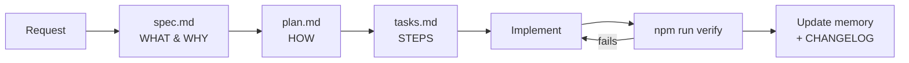

# 01 — Spec-Driven Development (SDD)

The **spec is the source of truth**. Code is a derived artifact that must satisfy the spec.

## Lifecycle

## Rules

1. **Locate or create the spec.** Every feature lives in `specs/NNN-kebab-name/`.
   Use the template in `specs/000-template/`. Numbers are sequential and never reused.
2. **`spec.md` defines WHAT and WHY** — user stories, acceptance criteria (Given/When/Then),
   non-functional requirements, out-of-scope. **No implementation details.**
3. **`plan.md` defines HOW** — files to touch, components, data shape, security impact, trade-offs.
4. **`tasks.md` is an ordered checklist** — small, verifiable steps. Tick `[x]` as you go.
5. **Spec status** in the front-matter: `draft → approved → implemented → deprecated`.
   Only implement `approved` specs. Set `implemented` once `verify` passes.
6. **Changing behavior = changing the spec first.** If the code and spec disagree, the spec wins
   (or the spec is updated through review).
7. **Acceptance criteria must be testable.** Prefer criteria that the harness can check automatically.
8. **Architectural decisions** that outlive a single spec go into `harness/memory/decisions/` as ADRs.

## Definition of Done

See [`harness/quality/definition-of-done.md`](../../harness/quality/definition-of-done.md).
