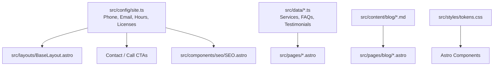

# Architecture — AutoLock Pro USA

This document outlines the software architecture, design principles, and technical organization of **AutoLock Pro USA**.

---

## 1. System Overview & Philosophy

AutoLock Pro USA is a **100% static, client-side frontend marketing website** designed for a nationwide 24/7 mobile automotive locksmith service in the United States.

### Core Principles

1. **Zero-Backend & Static Delivery:** The site compiles to pure static HTML, CSS, and minimal modern JavaScript. It can be hosted on any static edge network (Cloudflare Pages, Vercel, Netlify, S3, Nginx, Apache).
2. **Zero-Trust Security & Strict Content Security Policy (CSP):** The site does not load third-party scripts, remote fonts, external CDNs, or trackers. All assets (fonts, icons, styles, images) are self-hosted. Inline scripts and inline styles are strictly forbidden.
3. **Spec-Driven Development (SDD):** No code is written without a corresponding specification (`specs/NNN-*`). Behavior is governed by acceptance criteria before implementation.
4. **Resilient Engineering Harness:** Automated quality gates enforce type safety, linting, formatting, security scanning, and build integrity via `npm run verify`.
5. **Mobile-First Urgency UX:** Designed for drivers locked out of their cars on roadsides, parking lots, or residential driveways. High contrast, large touch targets (WCAG 2.2 AA), instant phone call conversion (`tel:`), and safe email contact.

---

## 2. Directory Structure

```text
├── .agents/                    # Agent orchestration: persistent rules and on-demand skills
│   ├── rules/                  # Always-on guidelines (context, SDD, security, code standards)
│   └── skills/                 # Task playbooks (write-spec, create-page, create-component, audit)
├── .vscode/                    # IDE workspace settings and recommended extensions
├── deploy/                     # Server configurations for custom hosting (Nginx, Apache)
├── docs/                       # Project documentation
│   ├── ARCHITECTURE.md         # System design and architecture (this file)
│   ├── CHANGELOG.md            # Versioned record of changes
│   ├── CONTRIBUTING.md         # Guidelines for human and agent contributors
│   ├── README.md               # Quickstart guide
│   └── STYLE-GUIDE.md          # Visual and code conventions
├── harness/                    # Engineering harness & governance
│   ├── memory/                 # Persistent state, ADRs (decisions), and lessons learned
│   ├── quality/                # Quality definitions (Definition of Done, Performance budget)
│   ├── scripts/                # Verification and security audit test runners
│   └── security/               # Threat model, CSP rules, dependency hygiene
├── public/                     # Static files copied verbatim to dist/ (robots.txt, headers, icons)
├── specs/                      # SDD specifications (spec.md, plan.md, tasks.md per feature)
├── src/                        # Astro application source code
│   ├── assets/                 # Optimized images and media
│   ├── components/             # Reusable Astro components (layout, ui, sections, seo)
│   ├── config/                 # Central site constants (phone, email, licenses, navigation)
│   ├── content/                # Content collections (Markdown blog posts)
│   ├── data/                   # Structured data modules (services, testimonials, FAQs)
│   ├── layouts/                # Base layouts (BaseLayout, BlogPostLayout)
│   ├── lib/                    # Pure utility functions with unit tests
│   ├── scripts/                # Bundled client-side scripts (copy email, filter blog)
│   └── styles/                 # Global styles, CSS reset, design tokens (tokens.css)
└── tests/                      # Unit and integration test suites (Vitest)
```

---

## 3. Technology Stack

- **Framework:** [Astro](https://astro.build/) (Static Site Generation mode)
- **Language:** TypeScript (`strict` mode)
- **Styling:** Modern Native CSS with CSS Custom Properties (Design Tokens), zero runtime CSS overhead, zero Tailwind CDN dependency.
- **Icons:** Bundled SVG icons via Iconify Material Symbols (inlined at build time, zero external network requests).
- **Typography:** Self-hosted Plus Jakarta Sans Variable font (`@fontsource-variable/plus-jakarta-sans`).
- **Testing:** [Vitest](https://vitest.dev/) for pure utility logic and security assertions.
- **Linting & Formatting:** ESLint (with `eslint-plugin-astro` and `typescript-eslint`) + Prettier.

---

## 4. Data Flow & Single Source of Truth



- **Business Details:** Phone number `(800) 555-0199`, email `autolockprousa@autolockprousa.com`, operating hours, and licensing information are defined **only once** in `src/config/site.ts`. No hardcoded phone numbers or emails exist across components.
- **Structured Data:** Schema.org JSON-LD (`Locksmith`, `Service`, `FAQPage`, `BlogPosting`) is dynamically derived from `src/config/site.ts` and `src/data/`.

---

## 5. Security & Threat Modeling

1. **Strict Content Security Policy:**

   ```http
   default-src 'none';
   script-src 'self';
   style-src 'self';
   img-src 'self' data:;
   font-src 'self';
   connect-src 'self';
   base-uri 'self';
   form-action 'none';
   frame-ancestors 'none';
   ```

2. **Clickjacking & Framing:** Prevented via `frame-ancestors 'none'` and `X-Frame-Options: DENY`.
3. **MIME Sniffing:** Prevented via `X-Content-Type-Options: nosniff`.
4. **Referrer Policy:** `strict-origin-when-cross-origin`.
5. **Supply Chain Security:** Pinned dependencies, `allowScripts` restricted to trusted build binaries (`esbuild`, `sharp`), automated dependency audits.
6. **No Forms / Zero Data Ingestion:** Removing database forms eliminates SQL Injection, CSRF, server-side data leaks, and GDPR/CCPA storage liabilities.

---

## 6. Scalability & Future Roadmap

- **i18n (Internationalization):** Architecture is structured so routes can easily be mapped under `src/pages/[lang]/` with translations loaded from `src/i18n/`.
- **Backend Expansion (Optional):** If dispatch requests or quote submissions require a backend later, Astro allows adding server endpoints (`output: 'hybrid'` or `'server'`) with adapters for Node, Cloudflare, or Vercel without rewriting frontend presentation logic.
